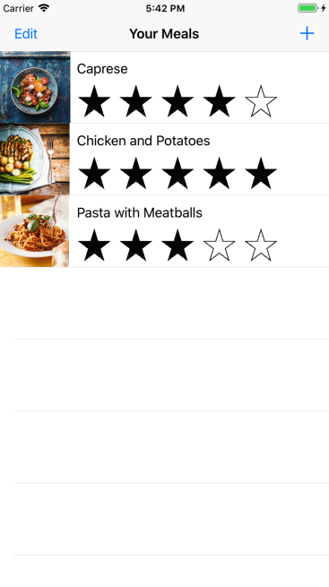
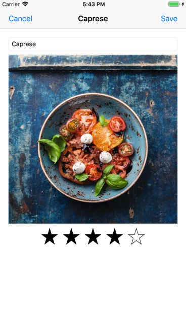

# Food Tracker

Food Tracker is a meal tracking iOS app allowing users to view, edit and add meal to the menu list. It is developed using Swift and following this [tutorial](https://developer.apple.com/library/archive/referencelibrary/GettingStarted/DevelopiOSAppsSwift/index.html#//apple_ref/doc/uid/TP40015214-CH2-SW1).

